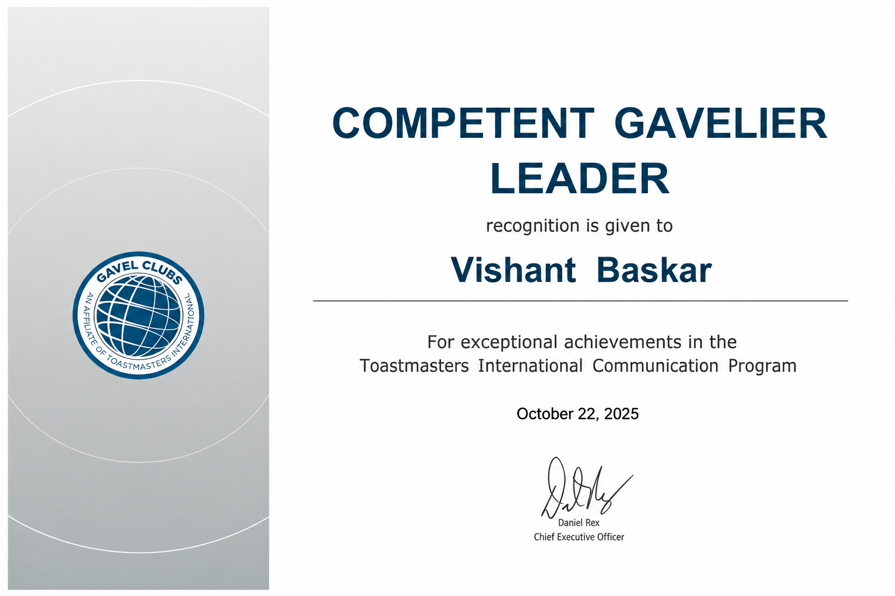
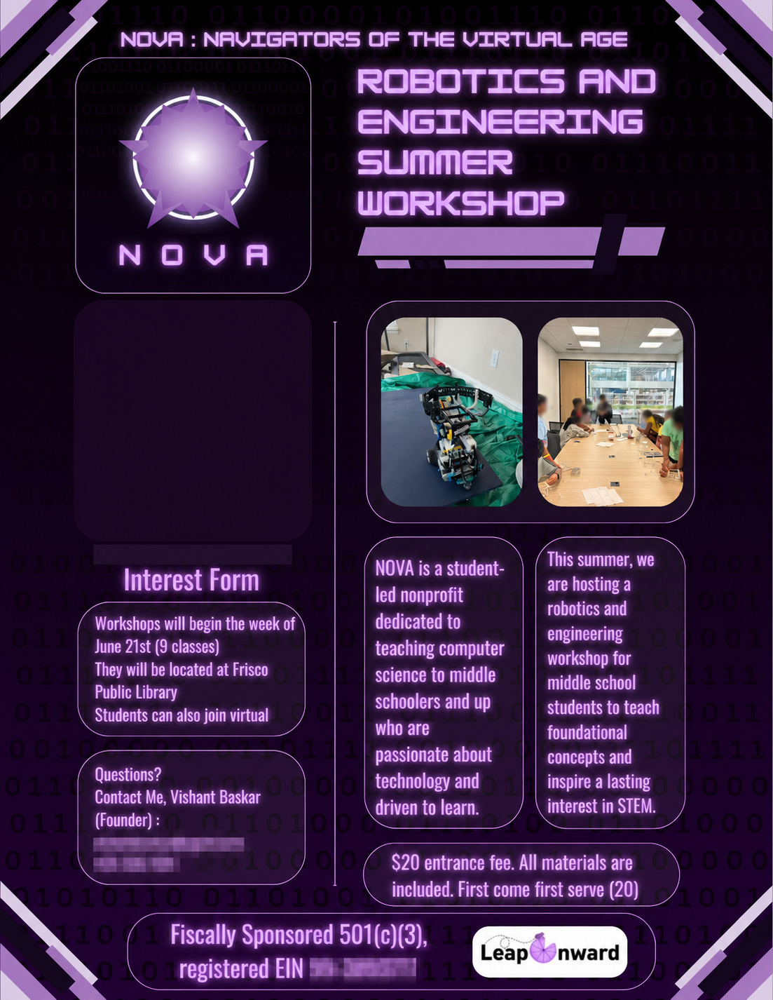
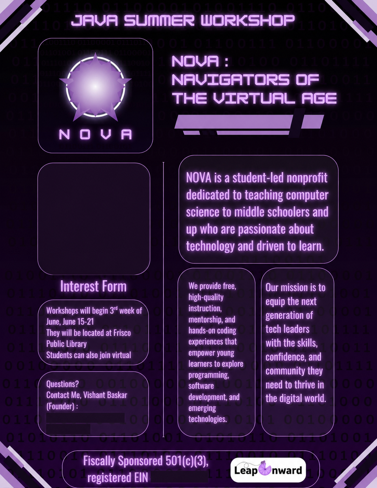

# Vishant Baskar — Awards & Achievements

This repository highlights Vishant Baskar’s academic, STEM, aerospace, computer-science, and language-learning achievements.

## Honors

- **Business Professionals of America (BPA):** Third place at the state competition and sixth place at the national competition
- **Texas VASE:** Advanced to the state event
- **Change Bowl — First Place:** Recognized for presenting an innovative idea designed to improve schools and communities. Change Bowl empowers young changemakers through mentorship, resources, and opportunities to turn community-focused ideas into meaningful action.
- **Eagle Scout**

## Highlights

### Texas Aerospace Scholars — 2026

Successfully completed the Texas Aerospace Scholars program in partnership with NASA’s Johnson Space Center, including the online course curriculum and the 2026 cohort experience at Johnson Space Center.

**Final TAS Grade:** 89.50

### Texas VASE State Event — 2026

Participated in the Texas Art Education Association Visual Art Scholastic Event (VASE) State Event with the artwork *Oh What a Beautiful World*. The entry competed in Division 2 and received a State Rating of 3.

### Youth Toastmasters Gavel Club Leadership — 2024–Present

Co-founded a youth Toastmasters Gavel Club with a friend. Served as vice president during 2024 and 2025 and currently serves as president, helping lead the club’s communication and public-speaking activities.

Received the **Competent Gavelier Leader** award on October 22, 2025, in recognition of exceptional achievement in the Toastmasters International Communication Program.

### NOVA Robotics and Engineering Summer Workshop — 2026

As the founder of NOVA, co-led a nine-class robotics and engineering summer workshop with two friends for middle school students. The program introduced foundational engineering concepts through guided instruction and hands-on robotics activities.

### NOVA Java Summer Workshop — 2025

As the founder of NOVA, co-led an eight-week summer Java programming workshop with two fellow student instructors for middle school students. The program introduced younger learners to programming through guided instruction and hands-on coding practice.

### National Society of High School Scholars — 2024

Granted membership in the National Society of High School Scholars in recognition of academic achievement, leadership, and scholarship.

### UT Austin WiSTEM Summer Camp — 2025

Participated in the University of Texas at Austin WiSTEM summer camp, “Consider Every Option: STEM in Sky & Space.”

### UT Dallas Computer Science Research Internship — 2025

Completed a summer research internship in Natural Language Processing with Python through the Department of Computer Science at The University of Texas at Dallas.

### UT Dallas Computer Science Summer Coding Camp — 2024

Completed the Object-Oriented Programming in Java summer coding camp through the Department of Computer Science at The University of Texas at Dallas.

### International Tamil Academy — 2024

Graduated in Tamil Language after completing the Tamil courses offered through the International Tamil Academy.

