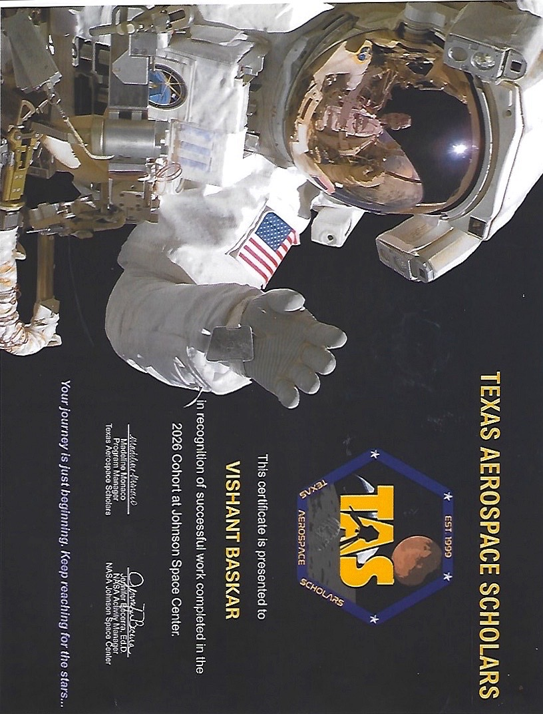
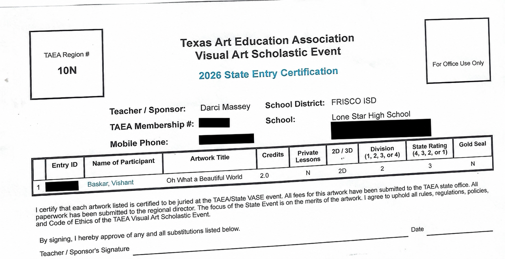
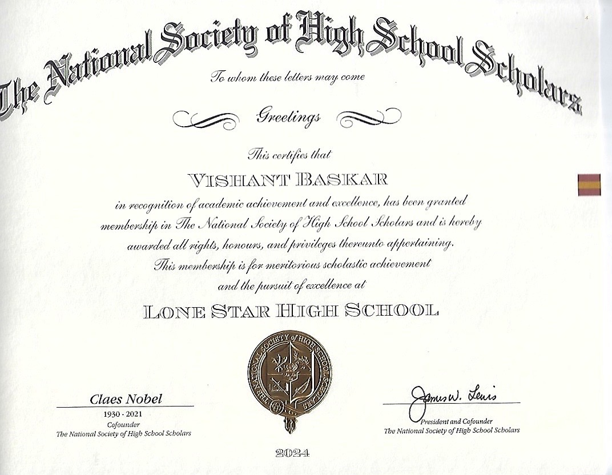
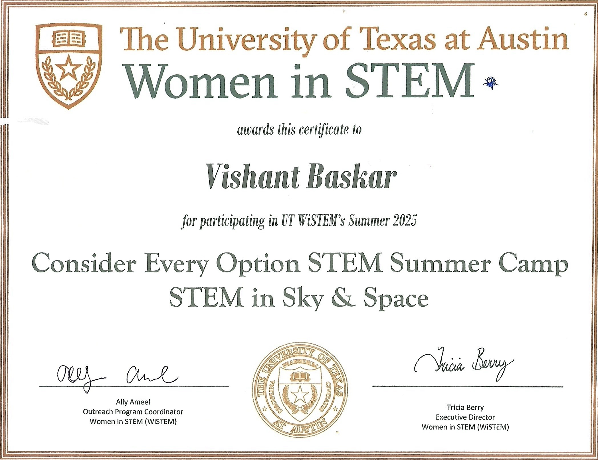
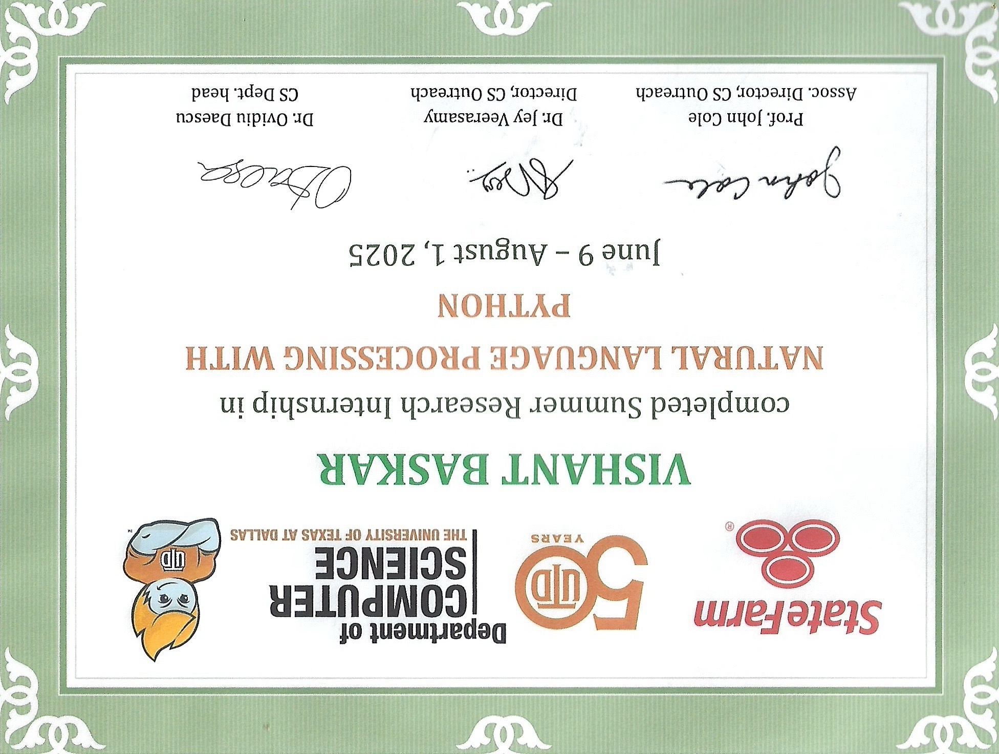
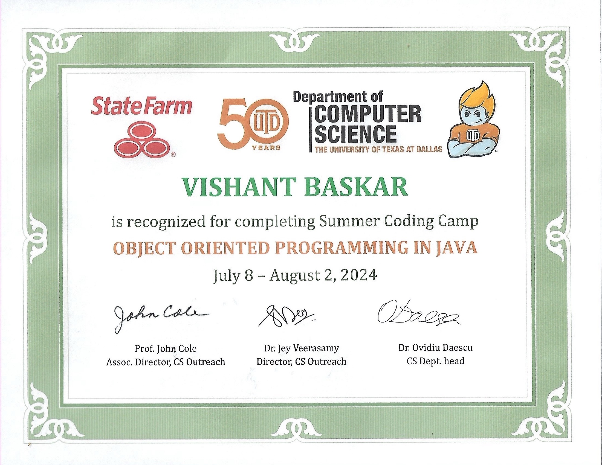
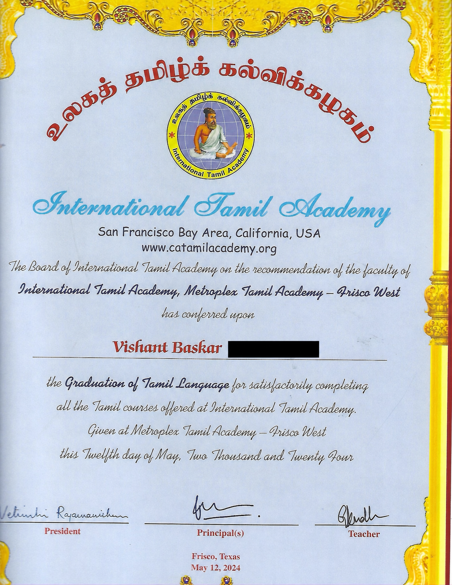

# Vishant Baskar — Awards & Achievements

This repository highlights Vishant Baskar’s academic, STEM, aerospace, computer-science, and language-learning achievements.

## Highlights

### Texas Aerospace Scholars — 2026

Successfully completed the Texas Aerospace Scholars program in partnership with NASA’s Johnson Space Center, including the online course curriculum and the 2026 cohort experience at Johnson Space Center.

**Final TAS Grade:** 89.50

### Texas VASE State Event — 2026

Participated in the Texas Art Education Association Visual Art Scholastic Event (VASE) State Event with the artwork *Oh What a Beautiful World*. The entry competed in Division 2 and received a State Rating of 3.

### Middle School Coding Camp Instructor — 2026

Conducted a coding camp for middle school students, helping younger learners develop foundational programming and problem-solving skills.

### Middle School Coding Camp Instructor — 2025

Conducted a coding camp for middle school students, introducing younger learners to programming concepts through guided activities and hands-on practice.

### National Society of High School Scholars — 2024

Granted membership in the National Society of High School Scholars in recognition of academic achievement, leadership, and scholarship.

### UT Austin WiSTEM Summer Camp — 2025

Participated in the University of Texas at Austin WiSTEM summer camp, “Consider Every Option: STEM in Sky & Space.”

### UT Dallas Computer Science Research Internship — 2025

Completed a summer research internship in Natural Language Processing with Python through the Department of Computer Science at The University of Texas at Dallas.

### UT Dallas Computer Science Summer Coding Camp — 2024

Completed the Object-Oriented Programming in Java summer coding camp through the Department of Computer Science at The University of Texas at Dallas.

### International Tamil Academy — 2024

Graduated in Tamil Language after completing the Tamil courses offered through the International Tamil Academy.

